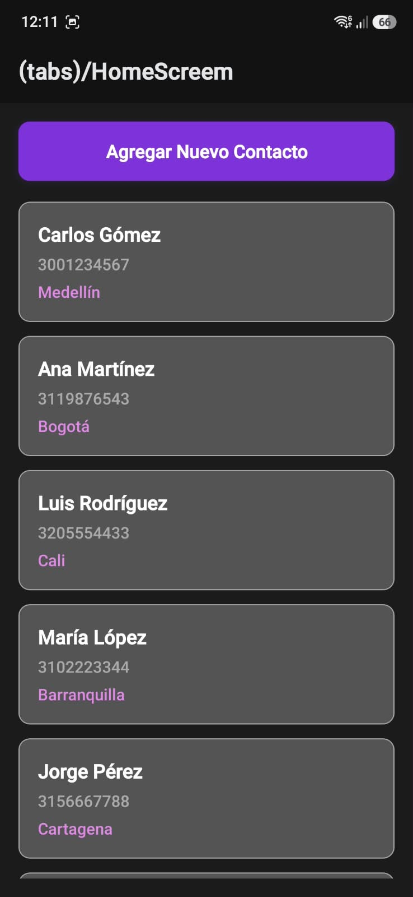
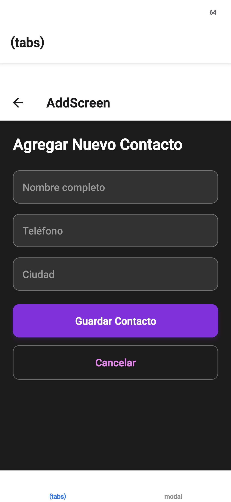
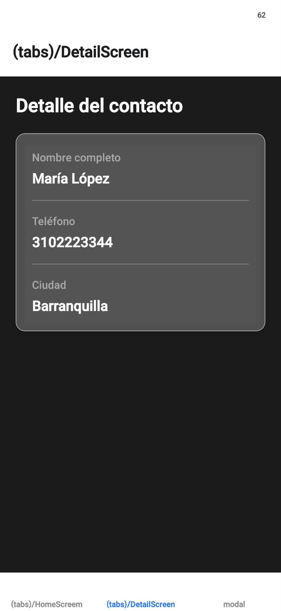

# Directorio de Contactos - React Native & Cloud Firestore

Aplicación móvil de tres pantallas desarrollada en React Native con Expo y conectada a Cloud Firestore para la gestión de contactos. Proyecto desarrollado como parte del taller de Desarrollo de Aplicaciones Móviles del Tecnológico de Antioquia.

## Información del Estudiante

* **Nombre completo:** Brayan Stiven Aldana Marcelo
* **Sistema Operativo de desarrollo:** Windows 11

---

## Funcionalidades

* **Lista de contactos:** consulta en tiempo real de la colección `contactos` en Firestore, con estados de carga, lista vacía y error de red (con reintento).
* **Agregar contacto:** formulario con validación de campos obligatorios (nombre, teléfono, ciudad) y feedback visual mientras se guarda.
* **Detalle de contacto:** consulta de un documento puntual por ID, con manejo de carga, error y contacto no encontrado.

## Tecnologías

* [Expo](https://docs.expo.dev/versions/v57.0.0/) SDK 57 / React Native 0.86
* [Expo Router](https://docs.expo.dev/router/introduction/) para la navegación basada en archivos
* [Cloud Firestore](https://firebase.google.com/docs/firestore) (Firebase JS SDK) como base de datos
* TypeScript + ESLint (`eslint-config-expo`)

---

## Requisitos Previos

* **Node.js:** versión LTS instalada.
* **Proyecto de Firebase** con Cloud Firestore habilitado (ver [Configuración de Firebase](#configuración-de-firebase)).
* **Dispositivo Móvil / Emulador:**
  * App **Expo Go** (SDK 57) instalada en un dispositivo físico (Android/iOS), o
  * Emulador de Android / Simulador de iOS previamente configurado.

---

## Pasos para Ejecutar el Proyecto

### 1. Clonar el repositorio
```bash
git clone https://github.com/brayanALD/TallerUnoConstruccionMovil
cd directorio-contactos
```

### 2. Instalar dependencias
```bash
npm install
```

### 3. Configurar Firebase
Copia el archivo de variables de entorno de ejemplo y completa cada valor con los datos de tu proyecto de Firebase (ver sección siguiente):
```bash
cp .env.example .env
```

### 4. Iniciar el proyecto
```bash
npm start
```
Escanea el código QR con la app **Expo Go** desde tu dispositivo, o presiona `a` / `i` en la terminal para abrir un emulador/simulador.

### Otros scripts disponibles

| Comando | Descripción |
| --- | --- |
| `npm start` | Inicia el servidor de desarrollo de Expo. |
| `npm run android` | Inicia el proyecto directamente en un emulador/dispositivo Android. |
| `npm run ios` | Inicia el proyecto directamente en un simulador/dispositivo iOS. |
| `npm run web` | Inicia el proyecto en el navegador. |
| `npm run lint` | Ejecuta ESLint sobre el proyecto. |

---

## Configuración de Firebase

1. Crea un proyecto en la [consola de Firebase](https://console.firebase.google.com/).
2. Registra una aplicación **Web** dentro del proyecto.
3. Crea una base de datos de **Cloud Firestore** (colección `contactos`, con los campos `nombre`, `telefono` y `ciudad`).
4. Copia las credenciales generadas al archivo `.env` en la raíz del proyecto, siguiendo el formato de `.env.example`:

```bash
EXPO_PUBLIC_FIREBASE_API_KEY=
EXPO_PUBLIC_FIREBASE_AUTH_DOMAIN=
EXPO_PUBLIC_FIREBASE_PROJECT_ID=
EXPO_PUBLIC_FIREBASE_STORAGE_BUCKET=
EXPO_PUBLIC_FIREBASE_MESSAGING_SENDER_ID=
EXPO_PUBLIC_FIREBASE_APP_ID=
```

El archivo `.env` no se sube al repositorio (ver `.gitignore`); cada quien debe usar las credenciales de su propio proyecto de Firebase.

---

## Estructura del proyecto

```
app/
├── (tabs)/
│   ├── HomeScreen.js     # Lista de contactos
│   ├── AddScreen.js      # Formulario para agregar contacto
│   ├── DetailScreen.js   # Detalle de un contacto
│   └── _layout.js
├── config/
│   └── firebase.js       # Inicialización de Firebase/Firestore
└── _layout.js             # Layout raíz (Expo Router)
```

---

## Capturas de pantalla

| Lista de contactos | Agregar contacto | Detalle de contacto |
| --- | --- | --- |
|  |  |  |

---

## Documentación adicional

Las respuestas teóricas del taller (entorno de desarrollo, fundamentos de React Native, navegación y configuración de Firebase) están documentadas en [`RESPUESTAS.md`](./RESPUESTAS.md).
